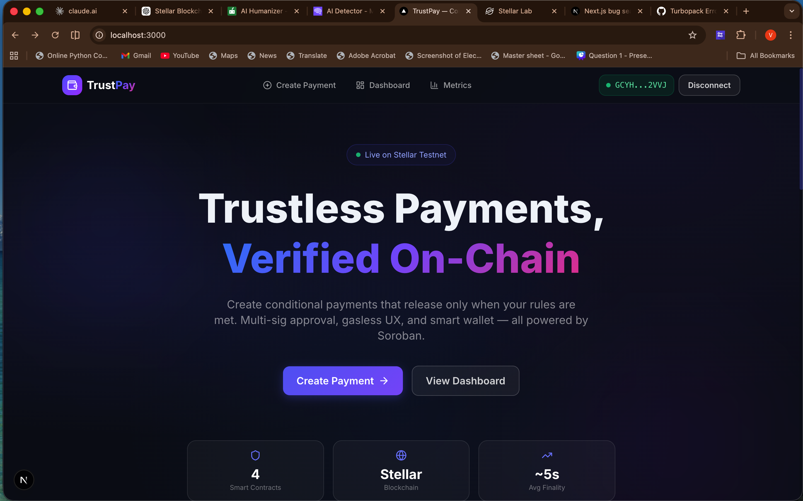
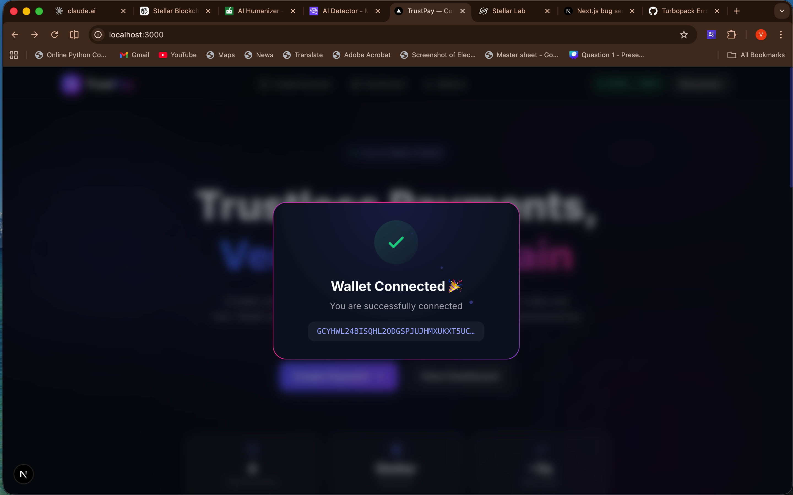

# 🚀 TrustPay — Conditional Smart Payments on Stellar

> Decentralized escrow-based payments powered by Soroban smart contracts. Create conditional payments that release only when multi-sig approval thresholds are met.

   

---

## 🌐 Live Demo

> **🔗 Live App:** [_Add your deployed URL here_](#)
>
> **🌍 Network:** Stellar Testnet

---

## 📸 Screenshots

### Home Page (Wallet Connected)



### Wallet Connection Success



---

## ✨ Features

- **Escrow Payments** — Lock funds on-chain, released only when conditions are met
- **Multi-Sig Approval** — Configurable M-of-N threshold (e.g., 2 of 3 approvers)
- **Gasless Transactions** — Fee bump sponsorship so users never pay gas
- **Smart Wallet** — Account abstraction with guardian-based recovery
- **Shareable Payment Links** — Easy onboarding via unique URLs
- **Real-time Dashboard** — Track payments, approvals, and platform metrics
- **Event Indexing** — On-chain events synced to MongoDB for fast queries
- **Mobile Responsive** — Fully responsive UI with modern glassmorphism design

---

## 📜 Deployed Contracts & Transaction Hashes

> All contracts are deployed on **Stellar Testnet**. Replace the placeholders below with actual values after deployment.

| Contract | Contract Address | Deployment TX Hash |
|----------|------------------|--------------------|
| **Escrow** | `CB36LTWOCZDZVENKUSATXOCLUJFWLL3OPKCUKFMEJYMJ6XVFEMU72QBS` | `929b92eafc11ff2b37b488ca65c98f0f8cd87dd37e177123cc82179aafb86832` |
| **Approval** | `CDFGCCSUYPNSOLRBLCB22E4N66LKUKYFK5KXHOMSDVZGCTSLCXFCJ3VR` | `117a2d651da91ac4095891e165748008d0919eaacb2f4f9ed71601f3052161b5` |
| **Smart Wallet** | `CCXN4MHFE2WMIWI23GXASELYSI7K7KXRVJYEP5QJJRCZGXQTNGRLF4KL` | `501b110be2152ff32ce6b7b9b5b1bda7202ff38b189d04b73537981c736e97a5` |
| **Fee Sponsor** | `CA66MG67DGI4BEJDXLXLC2UY27UJBJB46RI6FAZYOFV3M4O2BBKBNNU2` | `c140e30cb9e8a2d80dff10ac7b873e819d414464f4c15c065338c77b651410aa` |

**Verify on Stellar Explorer:**
- Stellar Expert: `https://stellar.expert/explorer/testnet/contract/<CONTRACT_ID>`
- StellarChain: `https://stellarchain.io/transactions/<TX_HASH>`

---

## 🏗️ Architecture

```
Frontend (Next.js 16 + Tailwind CSS v4)
        ↓ HTTP (REST API)
Backend (Node.js / Express / TypeScript)
        ↓ Soroban RPC
Soroban Smart Contracts (Rust → WASM)
  ├── Escrow Contract       — locks & releases funds
  ├── Approval Contract     — M-of-N threshold voting
  ├── Smart Wallet Contract — account abstraction
  └── Fee Sponsor Contract  — gasless TX tracking
        ↓
Stellar Network (Testnet)
        ↓ Event Indexer (polling)
MongoDB (Off-chain State & Analytics)
```

---

## 📦 Tech Stack

| Layer | Technology |
|-------|-----------|
| Smart Contracts | Rust + Soroban SDK 21.7.7 |
| Backend | Node.js, Express, TypeScript |
| Frontend | Next.js 16, Tailwind CSS v4, Framer Motion |
| Database | MongoDB + Mongoose |
| Wallet | Freighter (`@stellar/freighter-api`) |
| Blockchain | Stellar SDK (`@stellar/stellar-sdk` 15.x) |
| CI/CD | GitHub Actions + Vercel |

---

## 🚀 Getting Started — Full Setup Guide

### Prerequisites

Make sure you have the following installed before starting:

| Tool | Version | Install |
|------|---------|---------|
| **Node.js** | >= 20 | [nodejs.org](https://nodejs.org) |
| **npm** | >= 10 | Comes with Node.js |
| **Rust** | latest stable | `curl --proto '=https' --tlsv1.2 -sSf https://sh.rustup.rs \| sh` |
| **MongoDB** | >= 7.0 | [mongodb.com](https://www.mongodb.com/try/download/community) or use [MongoDB Atlas](https://www.mongodb.com/cloud/atlas) |
| **Freighter Wallet** | latest | [Browser Extension](https://www.freighter.app/) |
| **Stellar CLI** _(optional)_ | latest | `cargo install --locked stellar-cli` |

---

### Step 1: Clone the Repository

```bash
git clone https://github.com/<your-username>/TrustPay.git
cd TrustPay
```

---

### Step 2: Environment Configuration

```bash
cp .env.example .env
```

Open `.env` and fill in your values:

```env
# MongoDB
MONGODB_URI=mongodb://localhost:27017/trustpay   # or your Atlas URI

# Stellar Network
SOROBAN_RPC_URL=https://soroban-testnet.stellar.org:443
STELLAR_NETWORK_PASSPHRASE="Test SDF Network ; September 2015"
HORIZON_URL=https://horizon-testnet.stellar.org

# Fee Sponsorship (generate a testnet keypair at https://laboratory.stellar.org)
SPONSOR_SECRET_KEY=S...YOUR_SECRET_KEY...

# Contract IDs (fill after deployment)
ESCROW_CONTRACT_ID=
APPROVAL_CONTRACT_ID=
SMART_WALLET_CONTRACT_ID=
FEE_SPONSOR_CONTRACT_ID=
```

---

### Step 3: Build & Test Smart Contracts

```bash
# Install the WASM compilation target
rustup target add wasm32-unknown-unknown

# Navigate to contracts
cd contracts

# Build all 4 contracts
cargo build --release --target wasm32-unknown-unknown

# Run all tests (5 tests across 4 contracts)
cargo test
```

**Expected output:**
```
running 1 test — test_approval_threshold ... ok
running 2 tests — test_create_and_release ... ok, test_cancel ... ok
running 1 test — test_sponsorship_eligibility ... ok
running 1 test — test_wallet_owner_auth ... ok

test result: ok. 5 passed; 0 failed
```

```bash
# Return to project root
cd ..
```

---

### Step 4: Set Up & Run the Backend

```bash
cd backend

# Install dependencies
npm install

# Run tests (8 tests)
npm test

# Start the development server
npm run dev
# ✅ Server starts on http://localhost:3001
```

**Expected test output:**
```
 PASS  tests/payments.test.ts
 PASS  tests/sponsor.test.ts
Tests: 8 passed, 8 total
```

```bash
# Return to project root
cd ..
```

---

### Step 5: Set Up & Run the Frontend

```bash
cd frontend

# Install dependencies
npm install

# Start the development server
npm run dev
# ✅ App starts on http://localhost:3000
```

Open [http://localhost:3000](http://localhost:3000) in your browser. Click **"Connect Wallet"** to connect via Freighter.

---

### Step 6: Deploy Smart Contracts _(Optional)_

```bash
# Make the deploy script executable
chmod +x scripts/deploy-contracts.sh

# Run the deploy helper
./scripts/deploy-contracts.sh
```

Or deploy manually using the Stellar CLI:

```bash
# Deploy each contract to testnet
stellar contract deploy \
  --wasm contracts/target/wasm32-unknown-unknown/release/trustpay_escrow.wasm \
  --source <YOUR_SECRET_KEY> \
  --network testnet

# Initialize the escrow contract
stellar contract invoke \
  --id <ESCROW_CONTRACT_ID> \
  --source <YOUR_SECRET_KEY> \
  --network testnet \
  -- initialize --admin <YOUR_PUBLIC_KEY>
```

After deploying, paste the contract IDs into your `.env` file and restart the backend.

---

## 📊 API Endpoints

| Method | Endpoint | Description |
|--------|----------|-------------|
| `POST` | `/api/payments` | Create a new escrow payment |
| `GET` | `/api/payments` | List payments (filter by `?wallet=G...`) |
| `GET` | `/api/payments/:id` | Get payment details by ID or escrowId |
| `GET` | `/api/payments/link/:shareLink` | Resolve a shareable payment link |
| `GET` | `/api/contracts/escrow/:id` | Query on-chain escrow state |
| `GET` | `/api/contracts/approval/:id` | Query on-chain approval count |
| `POST` | `/api/contracts/approve` | Build an approval TX for wallet signing |
| `POST` | `/api/sponsor` | Submit a gasless (fee-bumped) transaction |
| `GET` | `/api/metrics` | Aggregated platform metrics |
| `GET` | `/api/health` | Health check |

---

## 🧪 Testing

```bash
# Smart contract tests (5 tests across 4 contracts)
cd contracts && cargo test

# Backend API tests (8 tests)
cd backend && npm test
```

| Suite | Tests | Status |
|-------|-------|--------|
| Escrow Contract | 2 (create+release, cancel) | ✅ Passing |
| Approval Contract | 1 (threshold validation) | ✅ Passing |
| Smart Wallet Contract | 1 (owner auth + guardians) | ✅ Passing |
| Fee Sponsor Contract | 1 (eligibility + budget) | ✅ Passing |
| Backend - Payments API | 5 (CRUD + validation) | ✅ Passing |
| Backend - Sponsor API | 3 (validation + routes) | ✅ Passing |

---

## 📜 Smart Contract Details

### Escrow Contract
- Locks tokens from sender to the contract address
- Inter-contract call to Approval contract for release verification
- Events: `escrow_created`, `escrow_released`, `escrow_cancel`

### Approval Contract
- Configurable M-of-N approval threshold
- On-chain tracking of individual approvals per escrow
- Events: `approval_init`, `approval_given`

### Smart Wallet Contract
- Custom `__check_auth` implementing `CustomAccountInterface` for account abstraction
- Guardian add/remove for social recovery
- Events: `wallet_init`, `wallet_exec`, `wallet_guardian`

### Fee Sponsor Contract
- Whitelist-based eligibility checks
- Per-user and global budget rate limiting
- Events: `sponsor_init`, `sponsor_record`, `sponsor_wl_add`

---

## 🔁 CI/CD

- **Contracts CI** (`contracts.yml`): Builds WASM and runs tests on push to `contracts/`
- **Frontend CD** (`frontend.yml`): Builds and deploys to Vercel on push to `main`

**Required GitHub Secrets:**
- `VERCEL_TOKEN`
- `VERCEL_ORG_ID`
- `VERCEL_PROJECT_ID`

---

## 📝 Environment Variables

See [`.env.example`](.env.example) for the full list. Key variables:

| Variable | Description |
|----------|-------------|
| `MONGODB_URI` | MongoDB connection string |
| `SOROBAN_RPC_URL` | Soroban RPC endpoint |
| `STELLAR_NETWORK_PASSPHRASE` | Network passphrase (testnet/mainnet) |
| `SPONSOR_SECRET_KEY` | Secret key for fee sponsorship account |
| `ESCROW_CONTRACT_ID` | Deployed escrow contract address |
| `APPROVAL_CONTRACT_ID` | Deployed approval contract address |
| `SMART_WALLET_CONTRACT_ID` | Deployed smart wallet contract address |
| `FEE_SPONSOR_CONTRACT_ID` | Deployed fee sponsor contract address |

---

## 📁 Project Structure

```
TrustPay/
├── contracts/                 # Soroban smart contracts (Rust)
│   ├── escrow/                # Escrow payment logic
│   ├── approval/              # Multi-sig approval threshold
│   ├── smart-wallet/          # Account abstraction
│   └── fee-sponsor/           # Gasless TX tracking
├── backend/                   # Express API server
│   ├── src/
│   │   ├── config/            # MongoDB connection
│   │   ├── models/            # Mongoose schemas
│   │   ├── routes/            # API endpoints
│   │   └── services/          # Stellar SDK, indexer, sponsor
│   └── tests/                 # Jest API tests
├── frontend/                  # Next.js web application
│   └── src/
│       ├── app/               # Pages (landing, create, claim, dashboard, metrics)
│       ├── components/        # Navbar, Footer, WalletPopup, ClientProviders
│       ├── context/           # WalletContext (Freighter integration)
│       └── lib/               # API client, Stellar helpers
├── scripts/                   # Deployment scripts
├── screenshots/               # App screenshots
└── .github/workflows/         # CI/CD pipelines
```

---

Built with ❤️ on [Stellar](https://stellar.org)
