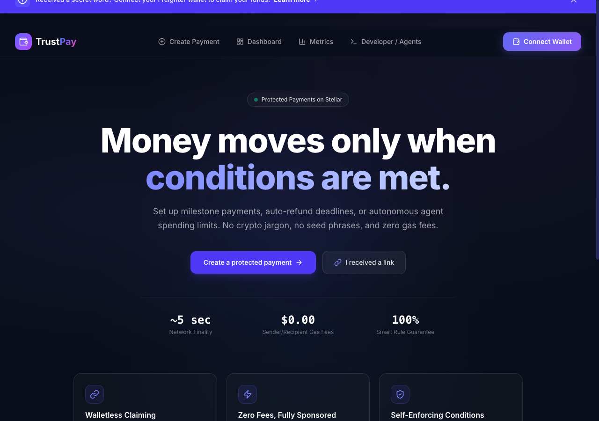
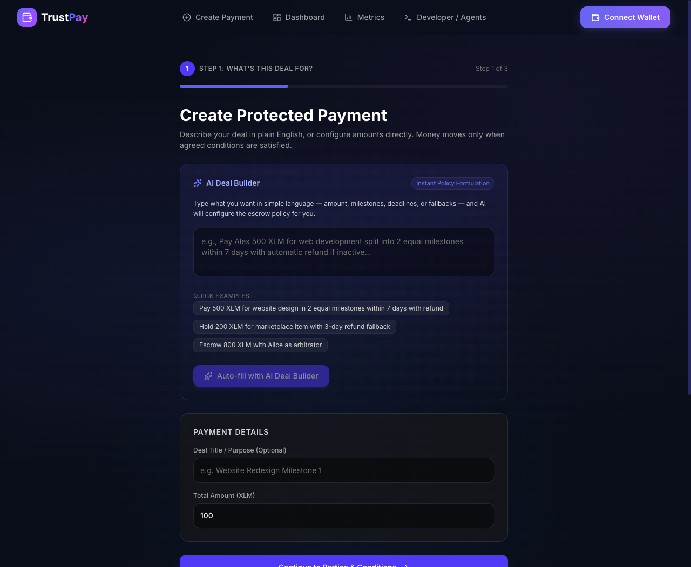
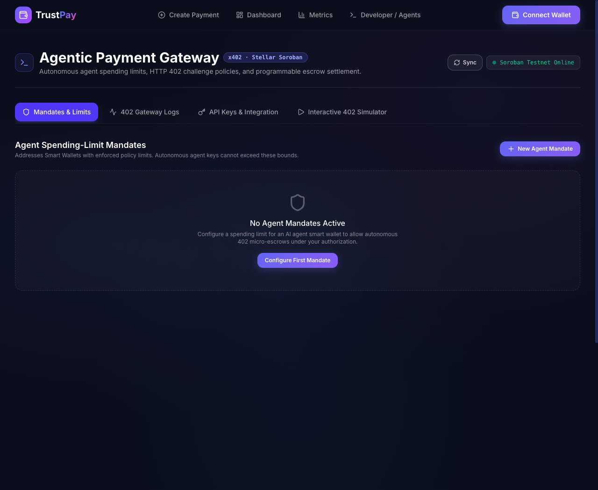
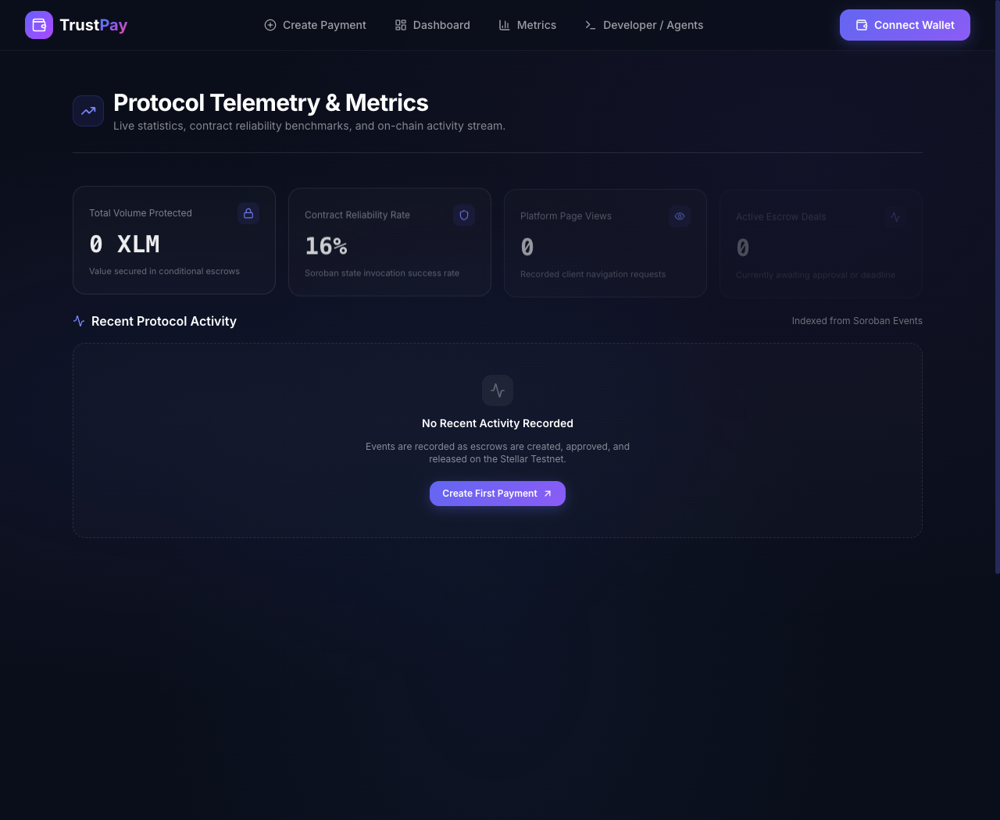
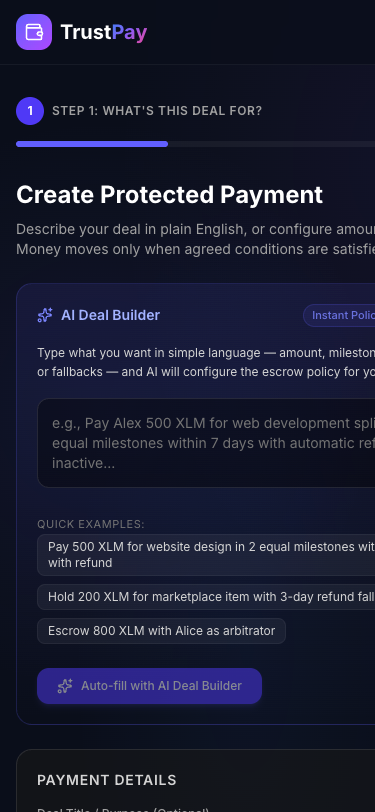

# 🚀 TrustPay — Conditional Smart Payments on Stellar

> Decentralized conditional payment platform and agentic escrow protocol powered by Soroban smart contracts on Stellar. Money moves only when predefined conditions are met — featuring milestone payouts, autonomous agent spending mandates, walletless recipient claiming, and deterministic plain-language transaction explanations.

    

---

## 🌐 Live Demo

> **🔗 Live App:** [https://trust-pay-pi.vercel.app/](https://trust-pay-pi.vercel.app/)
>
> **🌍 Network:** Stellar Testnet

---

## 📸 Product Showcase & Screenshots

### 1. Landing Page — Invisible Blockchain UX
Modern, uncluttered interface focusing on value proposition without intimidating crypto jargon. Zero-gas sponsorship and instant link lookups.


### 2. Create Deal — AI Deal Builder & Progressive Disclosure
Draft escrow policies in plain English (powered by Google Gemini with heuristic fallback) or customize milestone amounts, trust deadlines, and arbitrators.


### 3. Agentic Payment Gateway — x402 Protocol & Developer Console
Autonomous AI agent spending mandates bounded by Smart Wallet policies, live HTTP 402 challenge inspection, and an interactive 402 test simulator.


### 4. Protocol Telemetry & Metrics
Live aggregation of total volume protected, contract invocation reliability rates (%), platform page views, and on-chain event streams.


### 5. Mobile-First Responsiveness (375px Viewport)
Streamlined for real-world mobile recipients with touch-friendly controls and responsive layouts.


---

## ✨ Features

### 🛡️ Policy Engine (Soroban On-Chain Rules)
- **Multi-Sig Approval (M-of-N)**: Configurable voting threshold (e.g., 2 of 3 approvers) before funds release.
- **Milestone-Based Releases**: Partial payments unlocked as project phases complete, preventing all-or-nothing disputes.
- **Automatic Timeouts & Auto-Refunds**: Time-locked escrows that automatically refund the sender or release to the recipient upon deadline expiry using a public keeper pattern (`check_timeout()`).
- **Smart Dispute Resolution**: Arbitrator role assignment with on-chain cryptographic evidence hashing (`evidence_hash`).
- **Emergency Guardian Freeze**: Smart Wallet guardians can freeze pending escrows (`freeze_pending`) in case of suspected fraud.
- **Autonomous Spending Limits**: Period-based and per-transaction caps enforced directly in the Smart Wallet's `__check_auth` interface.

### 🤖 AI Deal Builder & Plain-Language Safety
- **AI Deal Builder**: Translates natural language agreements into structured Soroban policy parameters (milestones, deadlines, arbitrators) using Gemini structured schema output.
- **Explain Before You Sign**: Client-side transaction decoder that converts raw Soroban contract calls and parameters into plain-English human-verifiable commitments before any wallet signs.

### ⚡ Invisible Blockchain UX & Walletless Payments
- **Walletless Claiming**: Send payments to recipients who do not own a crypto wallet. Claiming generates temporary credentials secured with PIN-based key derivation (`scryptSync`).
- **One-Link Escrow**: Shareable links with mobile Web Share API integration (WhatsApp, Telegram, Email, and clipboard fallback).
- **Zero Gas Fees**: Fully sponsored transactions using fee-bump envelopes so end users never need XLM reserves to interact.

### 🌐 Agentic Payment Gateway (HTTP x402)
- **402 Payment Required**: Standardized machine-to-machine payment protocol where unauthenticated requests receive structured escrow payment requirements.
- **Agent Spending Mandates**: AI agents execute micropayments within human-defined limits set in their Smart Wallet policy.
- **Developer / Agent Console**: Complete management suite for API keys, mandate budgets, audit logs, and live simulator testing.

---

## 📜 Deployed Contracts & Transaction Hashes

> All contracts are deployed and verified on **Stellar Testnet**.

| Contract | Contract Address | Deployment TX Hash |
|----------|------------------|--------------------|
| **Escrow** | `CB36LTWOCZDZVENKUSATXOCLUJFWLL3OPKCUKFMEJYMJ6XVFEMU72QBS` | `929b92eafc11ff2b37b488ca65c98f0f8cd87dd37e177123cc82179aafb86832` |
| **Approval** | `CDFGCCSUYPNSOLRBLCB22E4N66LKUKYFK5KXHOMSDVZGCTSLCXFCJ3VR` | `117a2d651da91ac4095891e165748008d0919eaacb2f4f9ed71601f3052161b5` |
| **Smart Wallet** | `CCXN4MHFE2WMIWI23GXASELYSI7K7KXRVJYEP5QJJRCZGXQTNGRLF4KL` | `501b110be2152ff32ce6b7b9b5b1bda7202ff38b189d04b73537981c736e97a5` |
| **Fee Sponsor** | `CA66MG67DGI4BEJDXLXLC2UY27UJBJB46RI6FAZYOFV3M4O2BBKBNNU2` | `c140e30cb9e8a2d80dff10ac7b873e819d414464f4c15c065338c77b651410aa` |

**Verify on Stellar Explorer:**
- Stellar Expert: `https://stellar.expert/explorer/testnet/contract/<CONTRACT_ID>`
- StellarChain: `https://stellarchain.io/transactions/<TX_HASH>`

---

## 🏗️ Architecture

```
User / Autonomous Agent
        │
        ▼
Frontend (Next.js 16 + Tailwind CSS v4)
  ├── AI Deal Builder (Google Gemini Structured Parsing)
  ├── Explain Before You Sign (Client-Side Soroban Decoder)
  └── Developer Console (402 Gateway Inspector & Mandate Manager)
        ↓ HTTP (REST API / x402 Challenge)
Backend API (Node.js / Express / TypeScript)
  ├── x402 Gateway Responder & Agent Mandate Controller
  ├── Stellar & Soroban RPC Service (Transaction Construction)
  ├── Fee Bump Sponsor Service (Gasless Relayer)
  └── Telemetry & Event Indexer (Syncs to MongoDB)
        ↓ Soroban RPC / Horizon
Soroban Smart Contracts (Rust / WASM on Stellar Testnet)
  ├── Escrow Contract        — locks funds, milestones, keeper timeouts (check_timeout)
  ├── Approval Contract      — M-of-N voting, dispute arbitrator overrides, evidence hashes
  ├── Smart Wallet Contract  — account abstraction, guardian freeze_pending, spending limits
  └── Fee Sponsor Contract   — gasless transaction sponsorship and budget limits
        ↓
Stellar Network (Testnet)
        ↓ Event Ingestion
MongoDB Database (Off-Chain Analytics, Gateway Logs, Page Views)
```

---

## 📦 Tech Stack

| Layer | Technology |
|-------|-----------|
| **Smart Contracts** | Rust, Soroban SDK 21.7.7 |
| **Backend API** | Node.js, Express, TypeScript, Mongoose |
| **Frontend Web App** | Next.js 16 (App Router, Turbopack), Tailwind CSS v4, Lucide Icons |
| **AI Parsing** | Google Gemini API (`gemini-2.5-flash`) with structured schema & heuristic engine |
| **Agentic Gateway** | HTTP 402 Payment Required (x402 standard) with Stellar settlement |
| **Database** | MongoDB Atlas / Community Edition |
| **Wallet Integration** | Freighter (`@stellar/freighter-api`) & temporary secret keypairs |
| **Stellar SDK** | `@stellar/stellar-sdk` 15.x |
| **Deployment** | Vercel (Frontend), Node Server / Docker (Backend) |

---

## 🚀 Getting Started — Full Setup Guide

### Prerequisites

Make sure you have the following installed:

| Tool | Version | Install Link |
|------|---------|--------------|
| **Node.js** | >= 20 | [nodejs.org](https://nodejs.org) |
| **npm** | >= 10 | Bundled with Node.js |
| **Rust** | latest stable | `curl --proto '=https' --tlsv1.2 -sSf https://sh.rustup.rs \| sh` |
| **MongoDB** | >= 7.0 | [mongodb.com](https://www.mongodb.com) or [MongoDB Atlas](https://www.mongodb.com/cloud/atlas) |
| **Freighter Wallet** | latest | [freighter.app](https://www.freighter.app/) |

---

### Step 1: Clone the Repository

```bash
git clone https://github.com/VanshDeo/TrustPay.git
cd TrustPay
```

---

### Step 2: Configure Environment Variables

Create `.env` files for both backend and frontend.

**Backend (`backend/.env`):**
```env
PORT=3001
MONGODB_URI=mongodb://localhost:27017/trustpay

# Stellar Network
SOROBAN_RPC_URL=https://soroban-testnet.stellar.org:443
STELLAR_NETWORK_PASSPHRASE="Test SDF Network ; September 2015"
HORIZON_URL=https://horizon-testnet.stellar.org

# Fee Sponsorship Key (generate at https://laboratory.stellar.org)
SPONSOR_SECRET_KEY=S...YOUR_SPONSOR_SECRET_KEY...

# Deployed Contract Addresses
ESCROW_CONTRACT_ID=CB36LTWOCZDZVENKUSATXOCLUJFWLL3OPKCUKFMEJYMJ6XVFEMU72QBS
APPROVAL_CONTRACT_ID=CDFGCCSUYPNSOLRBLCB22E4N66LKUKYFK5KXHOMSDVZGCTSLCXFCJ3VR
SMART_WALLET_CONTRACT_ID=CCXN4MHFE2WMIWI23GXASELYSI7K7KXRVJYEP5QJJRCZGXQTNGRLF4KL
FEE_SPONSOR_CONTRACT_ID=CA66MG67DGI4BEJDXLXLC2UY27UJBJB46RI6FAZYOFV3M4O2BBKBNNU2

# AI Deal Builder (Google Gemini API)
GEMINI_API_KEY=your_gemini_api_key_here
```

**Frontend (`frontend/.env.local`):**
```env
NEXT_PUBLIC_API_URL=http://localhost:3001
NEXT_PUBLIC_ESCROW_CONTRACT_ID=CB36LTWOCZDZVENKUSATXOCLUJFWLL3OPKCUKFMEJYMJ6XVFEMU72QBS
NEXT_PUBLIC_APPROVAL_CONTRACT_ID=CDFGCCSUYPNSOLRBLCB22E4N66LKUKYFK5KXHOMSDVZGCTSLCXFCJ3VR
NEXT_PUBLIC_SMART_WALLET_CONTRACT_ID=CCXN4MHFE2WMIWI23GXASELYSI7K7KXRVJYEP5QJJRCZGXQTNGRLF4KL
NEXT_PUBLIC_FEE_SPONSOR_CONTRACT_ID=CA66MG67DGI4BEJDXLXLC2UY27UJBJB46RI6FAZYOFV3M4O2BBKBNNU2
```

---

### Step 3: Build & Test Smart Contracts

```bash
# Add WASM target
rustup target add wasm32-unknown-unknown

# Enter contracts directory
cd contracts

# Build all 4 contracts
cargo build --release --target wasm32-unknown-unknown

# Run the 14 contract unit & integration tests
cargo test
```

---

### Step 4: Set Up & Run the Backend API

```bash
cd backend

# Install dependencies
npm install

# Run the test suite (27 passing tests)
npm test

# Start the development server
npm run dev
# Server starts on http://localhost:3001
```

---

### Step 5: Set Up & Run the Frontend

```bash
cd frontend

# Install dependencies
npm install

# Build for production validation
npm run build

# Start the web app
npm run dev
# App starts on http://localhost:3000
```

---

## 📊 Complete API Reference

### Core Payment & Escrow Endpoints
| Method | Endpoint | Description |
|--------|----------|-------------|
| `POST` | `/api/payments` | Create a new conditional escrow payment with milestones and timeout rules |
| `GET` | `/api/payments` | List payments (supports filter by `?wallet=G...`) |
| `GET` | `/api/payments/:id` | Retrieve payment details by database ID or Soroban escrow ID |
| `GET` | `/api/payments/link/:shareLink` | Resolve a shareable payment link |
| `POST` | `/api/payments/link/:shareLink/claim` | Claim a walletless payment verifying PIN and transferring funds |

### Contract Interaction & Gasless Sponsorship
| Method | Endpoint | Description |
|--------|----------|-------------|
| `GET` | `/api/contracts/escrow/:id` | Fetch on-chain escrow state directly from Soroban RPC |
| `GET` | `/api/contracts/approval/:id` | Query current approval counts and milestone statuses |
| `POST` | `/api/contracts/approve` | Generate an unsigned approval transaction for wallet signing |
| `POST` | `/api/sponsor` | Relay fee-bumped envelope for zero-gas user transactions |

### AI Deal Builder
| Method | Endpoint | Description |
|--------|----------|-------------|
| `POST` | `/api/ai/parse-deal` | Parse plain-English deal text into structured policy JSON |

### Agentic Payment Gateway (x402)
| Method | Endpoint | Description |
|--------|----------|-------------|
| `GET` | `/api/gateway/resources` | List protected resources requiring escrow authorization |
| `GET` | `/api/gateway/resource/:id` | Returns `402 Payment Required` challenge or releases resource upon escrow proof |
| `POST` | `/api/gateway/pay` | Submit an agent payment authorized under a spending-limit mandate |
| `GET` | `/api/gateway/mandates` | List configured agent spending mandates |
| `POST` | `/api/gateway/mandates` | Register or update spending limits for an agent Smart Wallet |
| `GET` | `/api/gateway/logs` | Query audit trail of 402 challenges and settlements |
| `GET` | `/api/gateway/keys` | Retrieve active developer API keys |
| `POST` | `/api/gateway/keys` | Generate a new developer API key |

### Platform Metrics & Telemetry
| Method | Endpoint | Description |
|--------|----------|-------------|
| `GET` | `/api/metrics` | Retrieve total volume, reliability rates, and active escrows |
| `POST` | `/api/metrics/pageview` | Ingest lightweight page view telemetry beacon |
| `GET` | `/api/health` | Service health status check |

---

## 🧪 Comprehensive Test Suite

All tests across contracts and backend services are passing without warnings or errors.

```bash
# Run contracts test suite
cd contracts && cargo test

# Run backend test suite
cd backend && npm test
```

### Test Results Breakdown

| Test Suite | Total Tests | Status | Scope Covered |
|------------|:-----------:|:------:|---------------|
| **Escrow Contract** | 7 | ✅ Passed | Escrow create & release, cancel, timeout refunds, timeout releases, keeper panic checks, milestone freeze & evidence |
| **Approval Contract** | 2 | ✅ Passed | M-of-N threshold validation, arbitrator override logic |
| **Smart Wallet Contract** | 4 | ✅ Passed | Owner authentication, spending limit get/set, per-tx & period enforcement, invalid limit rejection |
| **Fee Sponsor Contract** | 1 | ✅ Passed | Whitelist sponsorship eligibility & user budget tracking |
| **Payments API** | 5 | ✅ Passed | Payment CRUD, milestone serialization, validation rules |
| **Sponsor API** | 3 | ✅ Passed | Fee-bump validation, transaction relayer |
| **AI Deal Builder** | 7 | ✅ Passed | Prompt parsing, Gemini schema extraction, rule-based heuristic fallback |
| **Agentic Gateway** | 7 | ✅ Passed | 402 challenge generation, escrow verification, mandate enforcement, API key generation |
| **Metrics & Telemetry** | 5 | ✅ Passed | Page view recording, aggregation queries, contract reliability calculation |
| **Frontend Build** | N/A | ✅ Passed | Next.js 16 Turbopack production compilation & TypeScript strict check |

---

## 📜 Smart Contract Method Details

### 1. Escrow Contract (`trustpay-escrow`)
- `create_escrow(...)`: Locks funds from sender, records milestones, timeout deadline, and fallback policy.
- `release(env, escrow_id)`: Verifies Approval contract threshold or arbitrator ruling; transfers locked funds to beneficiary.
- `cancel(env, escrow_id)`: Allows sender to cancel before funding/approval.
- `check_timeout(env, escrow_id)`: **Public keeper method.** Anyone can call when `current_time >= deadline` to execute the configured fallback (`RefundSender`, `ReleaseBeneficiary`, or `EscalateArbitrator`).
- `freeze(env, escrow_id)`: Halts operations on an escrow during active disputes.

### 2. Approval Contract (`trustpay-approval`)
- `init_approval(...)`: Initializes required approval threshold, allowed approvers, milestone indices, and arbitrator address.
- `approve(env, escrow_id, approver, milestone_index)`: Records an approver's vote for a given milestone.
- `arbitrator_override(env, escrow_id, arbitrator, release_to_beneficiary)`: Grants designated arbitrator binding authority to resolve disputes.
- `submit_evidence(env, escrow_id, submitter, evidence_hash)`: Permanently records a 32-byte cryptographic digest of evidence on-chain.

### 3. Smart Wallet Contract (`trustpay-smart-wallet`)
- `__check_auth(...)`: Custom Account Abstraction interface verifying owner signatures and enforcing spending limits against Soroban token transfers.
- `set_spending_limit(env, asset, limit_per_tx, limit_per_period, period_duration)`: Human owner configures bounded allowance for autonomous agent keys.
- `get_spending_limit(env, asset)`: Inspects active spending parameters and accumulated period spend.
- `freeze_pending(env, escrow_id)`: Guardian threshold function to pause execution of a specific pending escrow.
- `add_guardian(...)` & `remove_guardian(...)`: Social recovery administration.

### 4. Fee Sponsor Contract (`trustpay-fee-sponsor`)
- `record_sponsorship(env, user, fee)`: Enforces per-user quotas and cumulative budget rate limiting for gasless transactions.
- `add_to_whitelist(env, address)`: Admin whitelisting of authorized relayers and accounts.

---

## 📁 Repository Structure

```
TrustPay/
├── contracts/                   # Soroban smart contracts (Rust)
│   ├── Cargo.toml               # Workspace configuration
│   ├── escrow/                  # Conditional locking, milestones & timeouts
│   ├── approval/                # M-of-N policy, arbitrator & evidence
│   ├── smart-wallet/            # Account abstraction, spending limits & guardians
│   └── fee-sponsor/             # Fee-bump tracking & budget limits
├── backend/                     # Node.js Express API & Gateway
│   ├── src/
│   │   ├── config/              # MongoDB & Stellar SDK configurations
│   │   ├── models/              # Mongoose schemas (Payment, Gateway, Metrics)
│   │   ├── routes/              # Express routers (payments, gateway, ai, metrics, sponsor)
│   │   └── services/            # Stellar relayer, AI parser, event indexer
│   └── tests/                   # 27 Jest unit and integration tests
├── frontend/                    # Next.js 16 App Router web application
│   ├── src/
│   │   ├── app/                 # Routes (/, /create, /claim, /dashboard, /developer, /metrics)
│   │   ├── components/          # UI components (Navbar, Footer, ExplainBeforeYouSign, Banner)
│   │   ├── context/             # WalletContext (Freighter provider)
│   │   └── lib/                 # API client, transaction explainer, stellar helpers
│   └── screenshots/             # High-resolution application screenshots
├── scripts/                     # Deployment and initialization automation
└── .github/workflows/           # GitHub Actions CI/CD pipelines
```

---

## 📄 License

MIT License — see [LICENSE](LICENSE) for details. Built with ❤️ on [Stellar](https://stellar.org).
